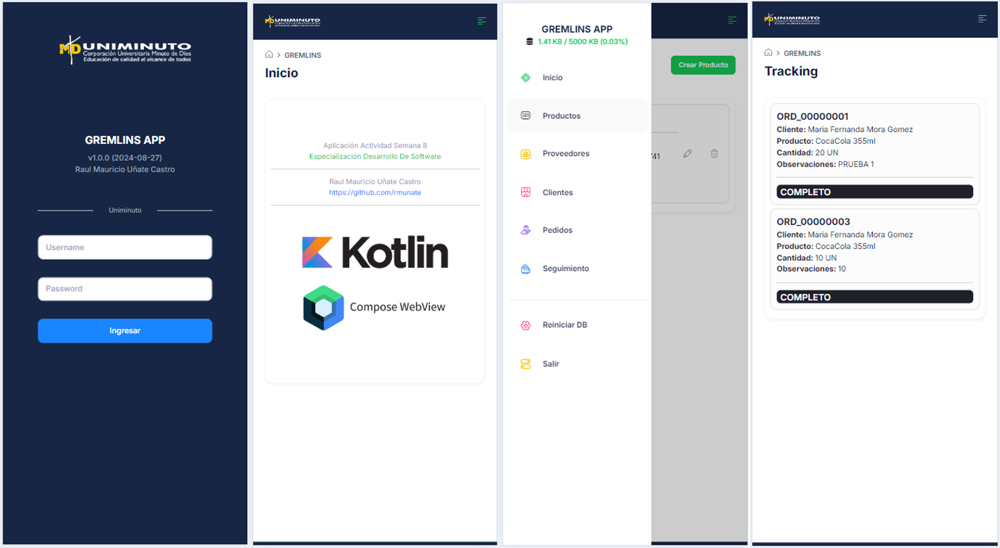

<h1 align="center">Gremlins App</h1>
<h3 align="center">Kotlin + Jetpack Compose + WebView</h3>

### Desarrollo
Desarrollo de aplicacion movil, con las caracteristicas solicitadas por el ejercicio de especializacion.
- Autenticación (admin:admin)
- Modulo Inicio
- Modulo Productos
- Modulo Proveedores
- Modulo Clientes
- Modulo Pedidos
- Modulo Seguimiento

### Caracteristicas
* El sistema permite ver la ocupacion del storage de acuerdo a la cantidad de datos que se vayan gestionando, creando y editando.
* La aplicación permite reiniciar el storage, con el fin de tener la aplicación en su version original.

### Flujo
1. Iniciar Sesión.
2. Crear Proveedor.
3. Crear Producto.
4. Crear Cliente.
5. Crear Pedido.
6. Ejecutar Seguimiento.

### Recortes
